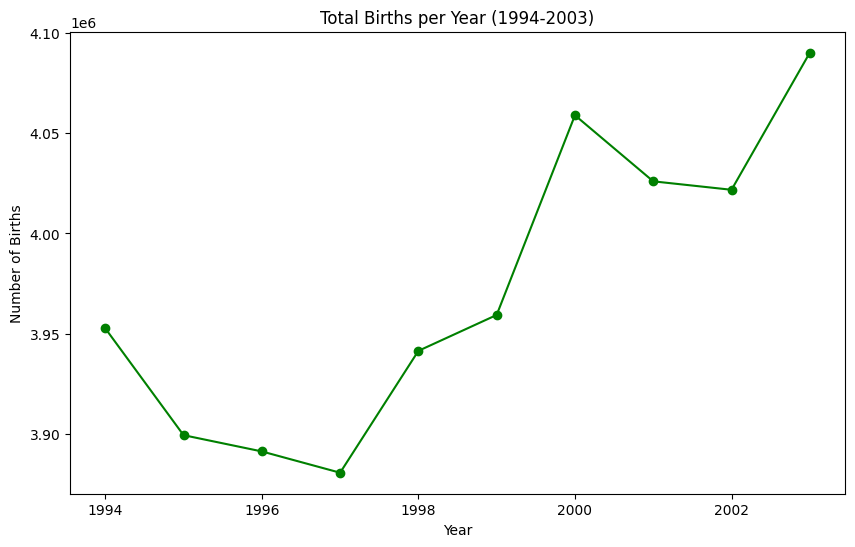
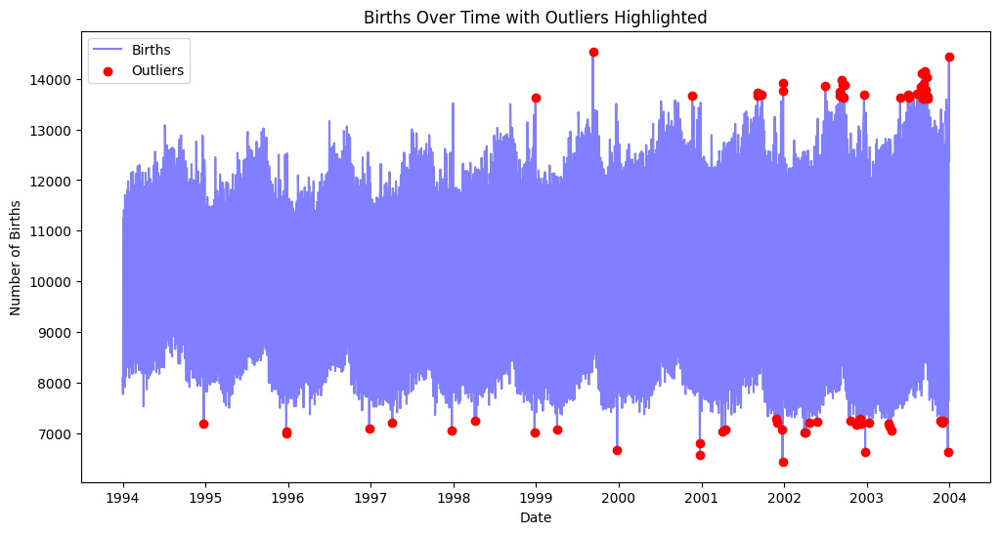

## Explanation of the Code Workflow
1. Set Up a Cloud-Hosted Jupyter Notebook (Google Colab)

2. Import required packages:
```python
import matplotlib.pyplot as plt
import seaborn as sns
import pandas as pd
```

3. Data Loading: It reads the data into a DataFrame using Pandas.
```python
dataset = "https://raw.githubusercontent.com/fivethirtyeight/data/master/births/US_births_1994-2003_CDC_NCHS.csv"
df = pd.read_csv(dataset)
```

4. Preprocess Data
+ First create a new column, 'date', by combining the year, month, and date_of_month columns into a single datetime object, making it easier to work with dates.
+ The data is grouped by year, calculating the total number of births for each year. This grouped data is stored in df_year, giving a yearly summary of births.

```python
# Convert 'year', 'month', and 'date_of_month' to a single 'date' column
df['date'] = pd.to_datetime(df[['year', 'month', 'date_of_month']].rename(columns={'date_of_month': 'day'}))

# Group the data by 'year' and calculate the total number of births for each year
df_year = df.groupby('year')['births'].sum().reset_index()
```

5. Data Manipulation
```python
# Calculate the mean of births per year (1994-2003)"""
mean = df_year['births'].mean()

# Calculate the median of births per year (1994-2003)"""
median = df_year['births'].median()

# Calculate the std of births per year (1994-2003)"""
std = df_year['births'].std()
```

6. Figure Plot
+ Bar plot: This bar plot shows the total number of births for each year from 1994 to 2003. Each bar represents the birth count for a specific year, making it easy to visually compare the total births across years. 


+ Line plot
This line plot displays the total births per year from 1994 to 2003. Here, a line connects each year’s birth total, and markers emphasize each year’s point.


3. Outliers in the dataset
This plot shows the daily birth counts over time, with red dots highlighting outliers. Outliers are defined as values in the top 1% or bottom 1% of daily births. This plot is useful for identifying anomalies or unusual birth counts that may correspond to significant events or data irregularities.

