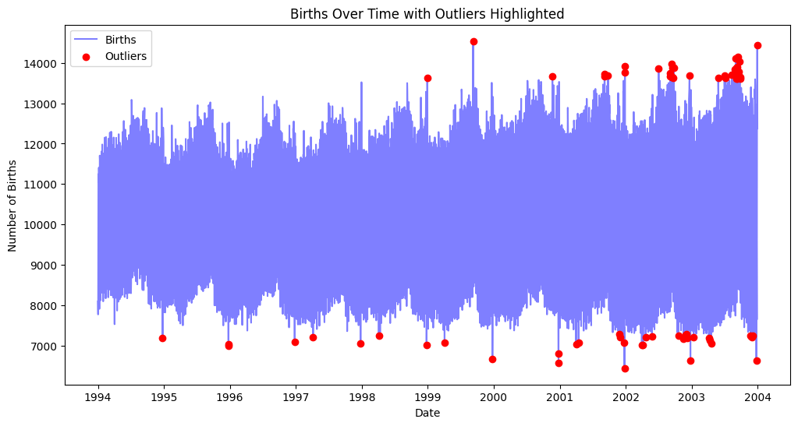

[](https://github.com/nogibjj/Mini_Proj3_Fuyao/actions/workflows/format.yml)
[](https://github.com/nogibjj/Mini_Proj3_Fuyao/actions/workflows/lint.yml)
[](https://github.com/nogibjj/Mini_Proj3_Fuyao/actions/workflows/format.yml)
[](https://github.com/nogibjj/Mini_Proj3_Fuyao/actions/workflows/test.yml)

# Mini Project 9

### Author name: Fuyao Li

## Overview
This project uses a cloud-hosted Jupyter Notebook to analyze the total number of births in the United States for each year from 1994 to 2003. The dataset used for this analysis is sourced from the [FiveThirtyEight dataset](https://raw.githubusercontent.com/fivethirtyeight/data/master/births/US_births_1994-2003_CDC_NCHS.csv) dataset, which contains detailed information on daily births during this period. This project uses `Polars` package for descriptive statistics.

## Requirements
+ Set up a cloud-hosted Jupyter Notebook (e.g., Google Colab)
+ Perform data manipulation tasks on a sample dataset

## Set up
1. Clone the repository:
``` shell
git clone git@github.com:nogibjj/Mini_Proj9_Fuyao_Li.git
```
## Google Colab Link
https://colab.research.google.com/drive/1Z91lhlNu3h3a3lg-KTunfIyRG-CH790R#scrollTo=-Q6JqkXr-W7d

## Result
1. Bar plot


2. Line plot


3. Outliers in the dataset

